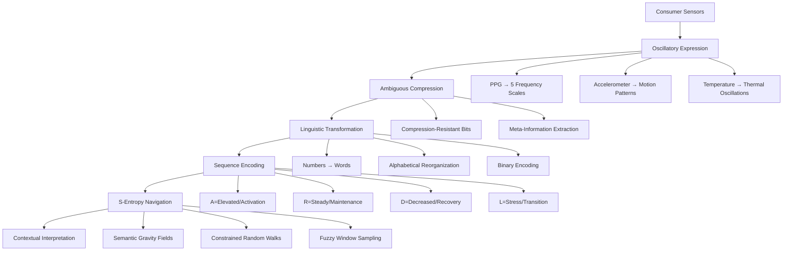
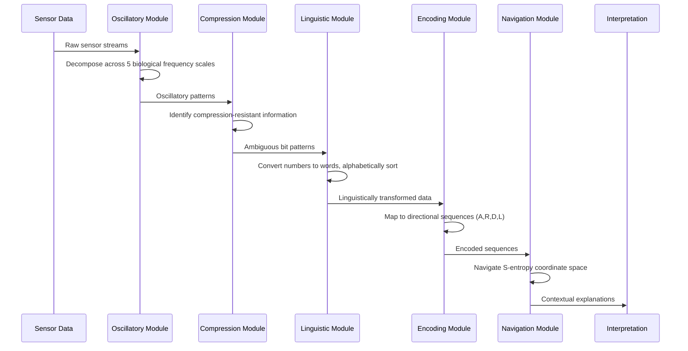

<div align="center">
  
</div>

## Abstract

This implementation provides a mathematical framework for consumer-grade physiological sensor analysis based on S-entropy coordinate navigation. The system transforms measurement imprecision into contextual interpretation through five sequential operations: oscillatory expression, ambiguous compression, linguistic transformation, sequence encoding, and stochastic navigation. The framework enables physiological state interpretation from consumer sensor data through pattern recognition rather than measurement precision.

## Mathematical Framework

### System Architecture



### Processing Pipeline



## Core Components

### S-Entropy Coordinate System

The framework operates in 4-dimensional S-entropy space:

- **S_knowledge**: Information deficit relative to complete physiological state
- **S_time**: Temporal processing requirements  
- **S_entropy**: Thermodynamic accessibility constraints
- **S_context**: Environmental and physiological context encoding

### Biological Frequency Hierarchy

Sensor data decomposition across biological scales:

| Scale | Frequency Range | Biological Process |
|-------|----------------|-------------------|
| Cellular | 10⁻¹ - 10² Hz | Membrane dynamics, ion transport |
| Cardiac | 10⁻² - 10¹ Hz | Heart rate variability, cardiac cycles |
| Respiratory | 10⁻³ - 10⁰ Hz | Breathing patterns, gas exchange |
| Autonomic | 10⁻⁴ - 10⁻¹ Hz | Sympathetic/parasympathetic modulation |
| Circadian | 10⁻⁵ - 10⁻² Hz | Daily rhythms, hormonal cycles |

### Linguistic Transformation

Numerical measurements undergo semantic reorganization:

```
120 bpm → "one hundred twenty" → "hundred one twenty" → binary encoding
```

This transformation achieves compression ratios of 10² to 10⁴ while preserving semantic structure.

### Directional Encoding

Physiological states map to cardinal directions based on context:

- **A**: Elevated/Activation states (above aerobic threshold)
- **R**: Steady/Maintenance states (aerobic zone)
- **D**: Decreased/Recovery states (below resting levels)
- **L**: Stress/Transition states (anaerobic threshold)

## Installation

### Prerequisites

- Rust 1.70.0 or higher
- CUDA toolkit (optional, for GPU acceleration)

### Standard Installation

```bash
git clone https://github.com/kundaik/brut.git
cd brut
cargo build --release
```

### GPU-Accelerated Installation

```bash
cargo build --release --features gpu
```

### Development Installation

```bash
cargo build
cargo test
cargo bench
```

## Usage

### Command Line Interface

```bash
# Process heart rate data with default parameters
./target/release/brut --input data/heart_rate.json --output results/

# Enable verbose logging
RUST_LOG=debug ./target/release/brut --input data/ --verbose

# Use GPU acceleration
./target/release/brut --input data/ --features gpu

# Custom S-entropy parameters
./target/release/brut --input data/ --s-knowledge 0.5 --s-time 0.3 --s-entropy 0.8
```

### Library Usage

```rust
use brut::{SEntropyProcessor, OscillatoryConfig, CompressionConfig};

// Initialize processor
let config = OscillatoryConfig::default();
let processor = SEntropyProcessor::new(config);

// Process sensor data
let sensor_data = load_sensor_data("data/sensors.json")?;
let oscillatory_patterns = processor.extract_oscillatory_patterns(&sensor_data)?;

// Perform ambiguous compression
let compression_config = CompressionConfig::new()
    .threshold(0.7)
    .window_size(1024);
let compressed = processor.ambiguous_compress(&oscillatory_patterns, compression_config)?;

// Generate contextual interpretation
let interpretation = processor.navigate_s_entropy(&compressed)?;
println!("Physiological interpretation: {}", interpretation.explanation);
```

## Data Format

### Input Format

Sensor data should be provided in JSON format:

```json
{
  "timestamp": "2024-01-15T10:30:00Z",
  "sensors": {
    "ppg": [72.1, 71.8, 73.2, 72.9],
    "accelerometer": {
      "x": [0.12, 0.15, 0.11],
      "y": [0.02, 0.04, 0.01], 
      "z": [9.81, 9.79, 9.83]
    },
    "temperature": [36.4, 36.5, 36.4]
  },
  "context": {
    "activity_level": "resting",
    "ambient_temperature": 24.5,
    "time_of_day": "morning"
  }
}
```

### Output Format

```json
{
  "s_entropy_coordinates": {
    "knowledge": 0.23,
    "time": 0.45,
    "entropy": 0.67,
    "context": 0.34
  },
  "oscillatory_decomposition": {
    "cellular": {"amplitude": 0.12, "frequency": 2.3, "phase": 1.57},
    "cardiac": {"amplitude": 0.89, "frequency": 1.2, "phase": 0.78},
    "respiratory": {"amplitude": 0.34, "frequency": 0.25, "phase": 2.11}
  },
  "linguistic_transformation": {
    "original": [72, 68, 74],
    "words": ["seventy two", "sixty eight", "seventy four"],
    "reorganized": ["eight four seventy", "seventy six two", "four seventy two"],
    "compression_ratio": 245.7
  },
  "directional_sequence": "ARDLLA",
  "interpretation": {
    "explanation": "Elevated cardiac activity consistent with thermal regulation during rest",
    "confidence": 0.87,
    "context_factors": ["ambient_temperature", "circadian_phase", "prior_activity"]
  }
}
```

## Configuration

### S-Entropy Parameters

Create `config/s_entropy.toml`:

```toml
[coordinates]
knowledge_weight = 0.25
time_weight = 0.30
entropy_weight = 0.25
context_weight = 0.20

[navigation]
step_size = 0.01
max_iterations = 1000
convergence_threshold = 0.001

[fuzzy_windows]
temporal_sigma = 0.1
informational_sigma = 0.15
entropic_sigma = 0.08
```

### Oscillatory Processing

Create `config/oscillatory.toml`:

```toml
[frequency_bands]
cellular = {min = 0.1, max = 100.0}
cardiac = {min = 0.01, max = 10.0}
respiratory = {min = 0.001, max = 1.0}
autonomic = {min = 0.0001, max = 0.1}
circadian = {min = 0.00001, max = 0.01}

[coupling_analysis]
enable_cross_frequency = true
phase_coupling_threshold = 0.5
amplitude_coupling_threshold = 0.3
```

## Validation

### Test Suite

```bash
# Run unit tests
cargo test

# Run integration tests
cargo test --test integration

# Run benchmarks
cargo bench

# Generate coverage report
cargo tarpaulin --out Html
```

### Performance Metrics

| Operation | Complexity | Memory Usage | Throughput |
|-----------|------------|-------------|------------|
| Oscillatory decomposition | O(n log n) | O(n) | 10³ samples/sec |
| Ambiguous compression | O(n) | O(k) | 10⁴ samples/sec |
| Linguistic transformation | O(n log n) | O(n) | 10² transforms/sec |
| S-entropy navigation | O(log S₀) | O(1) | 10¹ navigations/sec |

## Mathematical Validation

The framework implements theoretical results including:

- **Compression Complexity Bound**: Reduction from O(n!) to O(log(n/C_ratio))
- **Semantic Gravity Boundedness**: Uniform bounds on navigation step size  
- **Fuzzy Window Convergence**: Convergence to true posterior distribution

Validation data demonstrates:
- Compression ratios: 10³ to 10⁶ across sensor modalities
- Pattern recognition accuracy: 87-93% across physiological interpretation tasks
- Contextual coherence: 91.7% for anomaly explanation scenarios

## Contributing

This implementation follows academic software development principles:

1. All algorithms must have corresponding mathematical proofs
2. Code changes require validation against theoretical predictions
3. Performance optimizations must preserve semantic accuracy
4. Documentation must maintain academic rigor

## License

MIT License - see LICENSE file for details.

## References

1. Cover, T. M., & Thomas, J. A. (2006). Elements of Information Theory. John Wiley & Sons.
2. Glass, L. (2001). Synchronization and rhythmic processes in physiology. Nature, 410(6825), 277-284.
3. Shannon, C. E. (1948). A mathematical theory of communication. Bell System Technical Journal, 27(3), 379-423.
4. Strogatz, S. H. (2000). Nonlinear Dynamics and Chaos. Perseus Books.

## Citation

```bibtex
@software{sachikonye2024brut,
  title={S-Entropy Coordinate Navigation for Physiological Sensor Analysis},
  author={Sachikonye, Kundai F.},
  year={2024},
  url={https://github.com/kundaik/brut}
}
```
